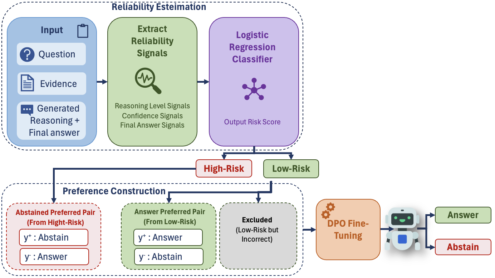
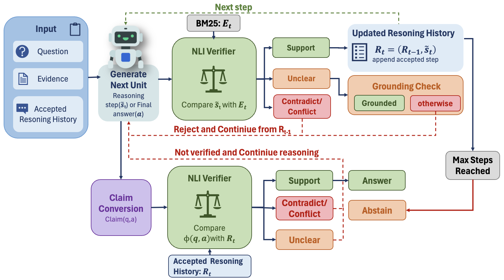

# Reasoning-Aware Abstention for Reducing Hallucinations in Multi-Hop Question Answering

> **MSc Artificial Intelligence Thesis Project**

This repository contains the implementation of my MSc Artificial Intelligence thesis on reducing hallucinations in **multi-hop question answering** through reasoning-aware reliability estimation and selective answering.

The project investigates whether reliability signals extracted from intermediate reasoning can help language models identify unreliable answers and **abstain rather than answer incorrectly**.

## Method Overview

The thesis explores two complementary reasoning-aware approaches.

### 1. Reliability-Guided DPO

Reliability signals from intermediate reasoning, answer confidence, and final-answer verification are combined to estimate the risk of an incorrect answer.

These reliability decisions are then used to construct **answer-vs-abstain preference pairs** for Direct Preference Optimisation (DPO), encouraging the model to answer when reliable and abstain when the generated answer is high-risk.

<p align="center">
  
</p>

### 2. Verifier-in-the-Loop Reasoning

The second approach integrates verification directly into the reasoning process. Candidate reasoning steps are checked against retrieved evidence before being added to the reasoning history.

Supported steps are retained, while contradicted or insufficiently grounded reasoning can be rejected. Final answers are also verified to determine whether the model should **answer or abstain**.

<p align="center">
  
</p>

## Datasets

Experiments are conducted on two multi-hop question-answering benchmarks:

- **HotpotQA**
- **2WikiMultiHopQA**

## Models & Methods

- **Base LLM:** Qwen2.5-7B-Instruct
- **NLI Verifier:** DeBERTa-v3-large
- **Sentence Embeddings:** BAAI/bge-small-en-v1.5
- **Answer Verification:** GPT-4o-mini
- **Retrieval:** BM25
- **Reliability Classifier:** Logistic Regression
- **Fine-tuning:** DPO with LoRA

## Repository Structure

```text
notebooks/
├── 01_iterative_reasoning_generation.ipynb
├── 02_reliability_classifier_and_dpo.ipynb
├── 03_verifier_in_the_loop.ipynb
├── 04_baselines.ipynb
└── 05_limitation.ipynb

assets/
├── fig_method_dpo.png
└── fig_method_verifier.png
```

The notebooks cover the main experimental pipeline:

1. **Iterative reasoning generation** and answer-confidence estimation
2. **Reliability estimation and reliability-guided DPO**
3. **Verifier-in-the-loop reasoning**
4. **Selective-answering baselines**
5. **Additional limitation and question-type analyses**

## Evaluation

The proposed approaches are compared with selective-answering baselines including **P(True), answer log-probability, verbalised confidence, semantic entropy, R-Tuning, CRaFT, and TruthRL**.

Main evaluation metrics include:

- AUROC
- Coverage
- Selective Accuracy
- Confident Error
- Over-Abstention
- Truthful Helpfulness Score (THS)
- DPO Decision Fidelity

## Running the Code

The notebooks are organised according to the experimental workflow and are intended to be followed in numerical order.

The original experiments were run primarily in **Google Colab**. Reproduction requires access to the datasets, relevant model checkpoints, sufficient GPU resources, and an OpenAI API key for components using GPT-4o-mini.

Large datasets, model checkpoints, intermediate outputs, and API credentials are not included in this repository.

## Thesis

**Reasoning-Aware Abstention for Reducing Hallucinations in Multi-Hop Question Answering**

MSc Artificial Intelligence Thesis  
**Golnoush Nematbakhsh**
